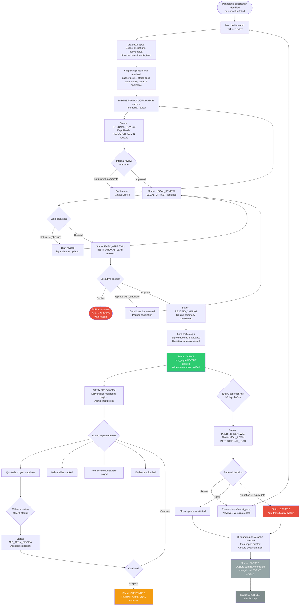
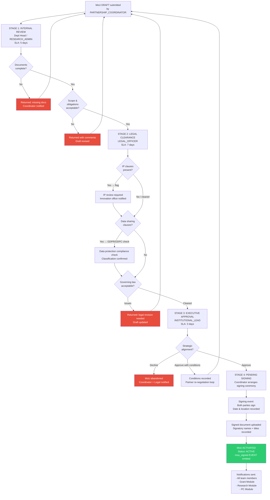
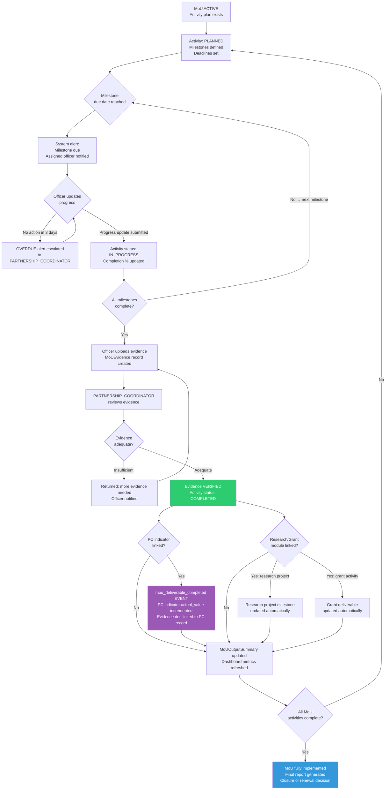

# Module 7 – MoU & Partnerships Management
**DACORIS Sub-Module Specification**  
**Version:** 1.0 | **Date:** May 2026 | **Stack:** FastAPI (Python) · PostgreSQL · Next.js · Material-UI  
**Parent Plan:** DACORIS Comprehensive Implementation Plan v1.4  
**Priority:** After Module 5 (Performance Contracting) | **Phase:** PC5+ / Standalone Sprint

---

## Table of Contents

1. [Overview & Strategic Fit](#1-overview--strategic-fit)
2. [Roles & Permissions](#2-roles--permissions)
3. [Sub-Modules & Features](#3-sub-modules--features)
   - 3.1 [MoU Repository & Document Management](#31-mou-repository--document-management)
   - 3.2 [Partner / Stakeholder Management](#32-partner--stakeholder-management)
   - 3.3 [Workflow & Approval Engine](#33-workflow--approval-engine)
   - 3.4 [Activity & Deliverables Tracking](#34-activity--deliverables-tracking)
   - 3.5 [Task & Responsibility Assignment](#35-task--responsibility-assignment)
   - 3.6 [Notification & Alert System](#36-notification--alert-system)
   - 3.7 [Reporting & Analytics Dashboard](#37-reporting--analytics-dashboard)
   - 3.8 [Renewal, Termination & Archiving](#38-renewal-termination--archiving)
   - 3.9 [Compliance & Legal Monitoring](#39-compliance--legal-monitoring)
   - 3.10 [Financial & Resource Tracking](#310-financial--resource-tracking)
4. [Data Models](#4-data-models)
5. [API Endpoints](#5-api-endpoints)
6. [Inter-Module Integration](#6-inter-module-integration)
   - 6.1 [Event Catalogue](#61-event-catalogue)
   - 6.2 [Grant Module Integration](#62-grant-module-integration)
   - 6.3 [Research Module Integration](#63-research-module-integration)
   - 6.4 [Performance Contracting Integration](#64-performance-contracting-integration)
7. [Workflows & Flowcharts](#7-workflows--flowcharts)
   - 7.1 [MoU Lifecycle (Master Flow)](#71-mou-lifecycle-master-flow)
   - 7.2 [Approval Workflow Detail](#72-approval-workflow-detail)
   - 7.3 [Renewal Workflow](#73-renewal-workflow)
   - 7.4 [Deliverable Tracking Flow](#74-deliverable-tracking-flow)
8. [State Machine](#8-state-machine)
9. [Backend Implementation Plan](#9-backend-implementation-plan)
10. [Frontend Implementation Plan](#10-frontend-implementation-plan)
11. [Advanced Features (Phase 2)](#11-advanced-features-phase-2)
12. [Security & Compliance](#12-security--compliance)
13. [Open Questions](#13-open-questions)

---

## 1. Overview & Strategic Fit

The **MoU & Partnerships Management Module** gives DACORIS a structured, end-to-end lifecycle engine for Memoranda of Understanding (MoUs), collaboration agreements, and partnership instruments. It transforms MoUs from static signed documents into actively monitored, measured, and institutionally valuable assets.

### Why This Module Belongs in DACORIS

DACORIS already tracks the *outputs* of partnerships — grants, publications, ethics applications, datasets, and performance indicators. This module tracks the *agreements* that create those partnerships, closing the loop:

| DACORIS Module | Relationship to MoUs |
|---|---|
| **Grant Management** | Grants are often won under an MoU; budgets can be co-funded by MoU partners |
| **Research Management** | Joint projects, student exchanges, and co-publications arise from MoUs |
| **Performance Contracting** | Number of MoUs signed is a standard Kenyan university PC indicator; deliverables feed PC evidence |
| **Data Module A** | Data-sharing agreements (a type of MoU) gate access to partner datasets |
| **Training Module** | Capacity-building activities listed in MoUs link to the LMS |

### Core Objectives

- Centralise all institutional MoUs in one governed repository
- Track the full lifecycle: Draft → Approval → Signing → Active → Renewal / Closure
- Monitor deliverables, milestones, and KPIs under each agreement
- Auto-populate Performance Contracting indicators (number of MoUs, partnership outputs)
- Auto-link to grant applications and research projects that arise from partnerships
- Trigger alerts for expiry, pending approvals, and missed deliverables
- Provide executive dashboards with geo-mapping of collaborations

---

## 2. Roles & Permissions

### 2.1 New Roles Required (add to `ResearchRole` enum)

| Role | Code | Description |
|---|---|---|
| MoU Administrator | `MOU_ADMIN` | Full CRUD on all MoUs within institution; manages workflow configuration |
| Legal Officer | `LEGAL_OFFICER` | Reviews and clears MoUs from a legal and compliance perspective |
| Partnership Coordinator | `PARTNERSHIP_COORDINATOR` | Day-to-day monitoring of active MoUs, deliverable tracking, partner comms |
| External Partner | `EXTERNAL_PARTNER` | Time-bounded, scoped read-only access to shared deliverable status |

> **Note:** These roles join the existing DACORIS Administrative Roles tier (Section 3.2 of the main plan). `MOU_ADMIN` and `LEGAL_OFFICER` are managed by `INSTITUTION_ADMIN`. `EXTERNAL_PARTNER` uses the same guest-expiry mechanism as `GUEST`.

### 2.2 Permission Matrix

| Permission | MOU_ADMIN | LEGAL_OFFICER | PARTNERSHIP_COORDINATOR | INSTITUTIONAL_LEAD | FINANCE_OFFICER | RESEARCHER / PI | EXTERNAL_PARTNER |
|---|---|---|---|---|---|---|---|
| Create MoU draft | ✅ | – | ✅ | – | – | – | – |
| Edit draft | ✅ | ✅ (legal sections) | ✅ | – | – | – | – |
| Submit for internal review | ✅ | – | ✅ | – | – | – | – |
| Legal clearance | ✅ | ✅ | – | – | – | – | – |
| Executive approval | – | – | – | ✅ | – | – | – |
| Record signing | ✅ | – | – | ✅ | – | – | – |
| Activate MoU | ✅ | – | – | – | – | – | – |
| Assign deliverables | ✅ | – | ✅ | – | – | – | – |
| Update deliverable progress | ✅ | – | ✅ | – | – | ✅ | – |
| Upload evidence | ✅ | – | ✅ | – | – | ✅ | ✅ (own) |
| View budget/financials | ✅ | – | – | ✅ | ✅ | ✅ (own) | – |
| Approve budget | – | – | – | – | ✅ | – | – |
| Initiate renewal | ✅ | – | ✅ | – | – | – | – |
| Close / terminate MoU | ✅ | ✅ | – | ✅ | – | – | – |
| View analytics dashboard | ✅ | – | ✅ | ✅ | ✅ | – | – |
| Configure partner profiles | ✅ | – | ✅ | – | – | – | – |
| View partner profile | ✅ | ✅ | ✅ | ✅ | ✅ | ✅ | ✅ |
| Export reports | ✅ | – | ✅ | ✅ | ✅ | – | – |

### 2.3 ABAC Conditions

- **Institution Isolation:** Users access only MoUs under their `institution_id`.
- **External Partner Scope:** `EXTERNAL_PARTNER` accounts are scoped to a specific `mou_id`; they cannot browse the full repository.
- **Legal Gate:** An MoU cannot advance past internal review without a `LEGAL_OFFICER` clearance record.
- **Executive Gate:** Signing cannot be recorded unless the executive approval stage is complete.
- **Embargo on Partner Data:** A partner's confidential profile fields are visible only to `MOU_ADMIN` and `PARTNERSHIP_COORDINATOR`.
- **Guest Expiry:** `EXTERNAL_PARTNER` accounts expire on the MoU's expiry date or earlier as configured.

---

## 3. Sub-Modules & Features

### 3.1 MoU Repository & Document Management

The central store for all agreement instruments.

**Features:**
- Upload signed MoUs and supporting documents (PDF, Word, scanned copies); S3-compatible storage (MinIO on-prem / S3 cloud)
- Version control: each amendment creates a new document version; full diff history
- Categorisation: partner institution, country/region, department, thematic area, funding source, MoU type, status
- Full-text search across MoU titles, partner names, objectives, and content
- Advanced filtering: expiry window, country, department, status, thematic area
- Duplicate detection: flag if a similar MoU with the same partner already exists (active or recently expired)
- Document integrity: SHA-256 checksum on upload; tamper detection
- Audit trail: every document upload, download, and version change is logged in `AuditEvent`

**MoU Types:**
- General Collaboration Agreement
- Academic Exchange Agreement
- Research Partnership Agreement
- Data-Sharing Agreement
- Joint Degree / Sandwich Programme Agreement
- Clinical / Hospital Collaboration Agreement
- Industry Partnership Agreement
- Consortium Agreement
- Co-Funding / Joint Grant Agreement

---

### 3.2 Partner / Stakeholder Management

A built-in CRM for institutional partners — distinct from, but linked to, the Funder CRM in Grant Module.

**Features:**
- Partner organisation profile: name, type, country, region, website, logo, accreditation status, contact details
- Focal person directory: name, title, email, phone, department, ORCID (if researcher)
- Collaboration history: all MoUs ever signed with this partner
- Communication log: emails, meetings, calls, key outcomes
- Partner performance summary: deliverables met vs. total, joint outputs (publications, grants, students)
- Duplicate detection by domain/name; merge tool for duplicates
- Partner tiers: Strategic, Active, Dormant (auto-assigned based on last 12 months of activity)

**Partner Types:**
- University / Academic Institution
- Research Institute / Think Tank
- Government Agency / Ministry
- NGO / Development Agency
- Hospital / Health System
- Industry / Private Sector
- Funder / Foundation
- International Organisation (UN, World Bank, etc.)

---

### 3.3 Workflow & Approval Engine

Manages the internal approval chain before and after signing, and the post-signing governance cycle.

**Workflow Stages:**

| Stage | Status Code | Actor(s) | SLA |
|---|---|---|---|
| Draft Creation | `DRAFT` | MOU_ADMIN, PARTNERSHIP_COORDINATOR | – |
| Internal Review | `INTERNAL_REVIEW` | RESEARCH_ADMIN, Department Head | 5 days |
| Legal Clearance | `LEGAL_REVIEW` | LEGAL_OFFICER | 7 days |
| Executive Approval | `EXEC_APPROVAL` | INSTITUTIONAL_LEAD | 3 days |
| Pending Signing | `PENDING_SIGNING` | MOU_ADMIN (records signing date & signatories) | Configurable |
| Active | `ACTIVE` | System (auto-transition on signing) | – |
| Under Review (mid-term) | `MID_TERM_REVIEW` | PARTNERSHIP_COORDINATOR | Per schedule |
| Pending Renewal | `PENDING_RENEWAL` | MOU_ADMIN, INSTITUTIONAL_LEAD | 30 days before expiry |
| Suspended | `SUSPENDED` | INSTITUTIONAL_LEAD | – |
| Expired | `EXPIRED` | System (auto-transition on expiry date) | – |
| Closed | `CLOSED` | MOU_ADMIN, INSTITUTIONAL_LEAD | – |
| Archived | `ARCHIVED` | System (auto-transition after closure) | 90 days after closure |

**Engine Features:**
- Configurable stage ordering per MoU type
- Parallel approvals (e.g., Legal + Finance can review simultaneously)
- Return-with-comments at any stage; PI / initiating officer notified with reason
- Digital signature record: signatory name, title, date, scan of signed page (file upload)
- Amendment workflow: triggers a new mini-approval cycle for any change post-signing
- SLA tracking: overdue stage alerts sent to stage actor and their supervisor

---

### 3.4 Activity & Deliverables Tracking

Tracks all commitments made under each MoU.

**Features:**
- Activity plan: structured list of activities linked to MoU obligations
- Milestone tracking: each activity broken into milestones with due dates, owners, status
- Deliverable types: joint training, research project, student exchange, publication, grant application, technology transfer, policy brief, workshop/event, consultancy, equipment sharing
- Progress updates: free-text plus percentage completion; evidence file upload
- KPI assignment per deliverable: links to Performance Contracting indicators
- Gantt-style timeline view per MoU
- Overdue deliverable flagging with automated alerts
- Bulk status update for batch reporting periods

**Deliverable Status:**

`PLANNED` → `IN_PROGRESS` → `EVIDENCE_SUBMITTED` → `VERIFIED` → `COMPLETED`  
`PLANNED` → `DELAYED` → `IN_PROGRESS` → ...  
`PLANNED` → `CANCELLED` (with justification, archived)

---

### 3.5 Task & Responsibility Assignment

Fine-grained task management under each activity.

**Features:**
- Assign tasks to internal staff or external partners (via `EXTERNAL_PARTNER` scoped login)
- Task deadlines with reminder notifications
- Task dependencies (task B cannot start until task A is complete)
- Escalation: if task is overdue by X days, auto-escalate to PARTNERSHIP_COORDINATOR
- Comments and discussion thread per task
- Link task completion → deliverable progress update

---

### 3.6 Notification & Alert System

Uses the existing DACORIS notification framework (Celery Beat + email + in-app).

| Alert Trigger | Recipients | Timing |
|---|---|---|
| MoU expiring in 90 days | MOU_ADMIN, PARTNERSHIP_COORDINATOR, INSTITUTIONAL_LEAD | 90 days before expiry |
| MoU expiring in 30 days | Same + Department Head | 30 days before expiry |
| MoU expiry (day of) | All above + system auto-transition to EXPIRED | Day of expiry |
| Pending approval overdue | Stage actor + supervisor | SLA breach |
| Deliverable milestone overdue | Assigned officer + PARTNERSHIP_COORDINATOR | Day of + 3 days |
| Signing date approaching | MOU_ADMIN, INSTITUTIONAL_LEAD | 7 days before signing |
| MoU activated | All internal team members | Immediate |
| Task assigned (new) | Assignee | Immediate |
| External partner submits evidence | PARTNERSHIP_COORDINATOR | Immediate |
| Amendment submitted | Legal Officer, INSTITUTIONAL_LEAD | Immediate |
| Mid-term review due | PARTNERSHIP_COORDINATOR | Per schedule |
| Grant linked to this MoU | MOU_ADMIN, PI | Immediate |

---

### 3.7 Reporting & Analytics Dashboard

**Dashboard Metrics:**
- Total MoUs: active / pending / expiring (30/60/90 days) / expired / closed
- MoUs by country / region (geo-map)
- MoUs by department / thematic area (treemap or bar)
- MoUs by partner type
- Deliverable completion rate (overall and per MoU)
- Joint outputs: publications, grants, students, patents (auto-populated from other modules)
- Financial utilisation: budget committed vs. spent under MoU-linked activities
- Partnership value score (weighted composite of outputs, activity, and strategic fit)
- New MoUs signed (current year vs. previous year)
- Renewal rate

**Reports:**
- Quarterly partnership activity report (MoU list + deliverable progress + outputs)
- Annual MoU portfolio report (PDF export, institutional letterhead)
- Partner performance report (per partner, showing all joint activity)
- Compliance report (MoUs with overdue legal review, missing documents)
- Executive summary (1-page dashboard export, PDF)
- GPCIS-format export for Kenyan PC system (MoU count + deliverables as evidence)

**Geo-Map Feature:**
- World map visualisation of partner countries
- Bubble size = number of active MoUs with that country
- Click country → list of MoUs
- Filter by: thematic area, department, MoU type, status

---

### 3.8 Renewal, Termination & Archiving

**Renewal:**
- 90-day expiry alert triggers `PENDING_RENEWAL` review
- Coordinator reviews: continue / renew / close
- Renewal can be: full renewal (new MoU document, new terms), extension (same terms, new dates), or conversion (MoU upgraded to formal agreement)
- New MoU version created; old version archived with link preserved
- Renewal triggers re-approval workflow (configurable: full workflow vs. expedited executive sign-off)

**Termination / Closure:**
- Either party can initiate closure; `INSTITUTIONAL_LEAD` must approve
- Closure documentation: reason, date, outcomes achieved, lessons learned
- Outstanding deliverables: resolved (completed / cancelled / transferred) before closure finalised
- All linked grants, projects, and tasks receive notification
- Closure record archived permanently; not deletable

**Archiving:**
- Automatically after 90 days in `CLOSED` state
- Archive includes: all document versions, approval history, deliverable records, communications log, financial summary
- Read-only access for `MOU_ADMIN` and `INSTITUTIONAL_LEAD`

---

### 3.9 Compliance & Legal Monitoring

**Features:**
- Policy compliance checklist: configurable list of institutional requirements per MoU type
- Regulatory flags: GDPR (for EU partners), ODPC (Kenya Data Protection Act), IP clauses, confidentiality obligations
- Data-sharing agreements: special subtype with data classification, data categories, permitted uses, deletion obligations, DPA signatory tracking
- IP management: flag IP clauses, link to Innovation/Patent records in Research Module
- Audit trail: every access, download, approval, and status change logged with actor, timestamp, IP address
- Risk rating: Low / Medium / High per MoU (based on configurable criteria: financial commitment, data sensitivity, jurisdiction, partner type)
- Compliance dashboard: overdue compliance tasks, missing required clauses, pending legal review

---

### 3.10 Financial & Resource Tracking

**Features:**
- Budget commitments recorded per MoU: total committed, by party, by currency
- Cost-sharing breakdown: institution contribution vs. partner contribution
- Payment schedule: milestone-based or time-based
- Link MoU financial commitments → Grant Module budgets (if funded via a grant)
- Resource commitments: equipment, personnel time, facilities (non-financial)
- Utilisation tracking: actual spend vs. committed; variance flags
- Currency handling: multi-currency with conversion at recording date
- Finance system sync: connects to QuickBooks / SAP / Oracle / Custom connectors for actual expenditure

---

## 4. Data Models

```sql
-- Core MoU record
MoU
  id                      UUID PRIMARY KEY
  institution_id          UUID REFERENCES institutions
  mou_number              VARCHAR UNIQUE  -- system-generated: MOU-{YEAR}-{SEQ}
  title                   VARCHAR NOT NULL
  mou_type                ENUM(GENERAL_COLLABORATION, ACADEMIC_EXCHANGE, RESEARCH_PARTNERSHIP,
                               DATA_SHARING, JOINT_DEGREE, CLINICAL, INDUSTRY, CONSORTIUM,
                               CO_FUNDING)
  status                  ENUM(DRAFT, INTERNAL_REVIEW, LEGAL_REVIEW, EXEC_APPROVAL,
                               PENDING_SIGNING, ACTIVE, MID_TERM_REVIEW, PENDING_RENEWAL,
                               SUSPENDED, EXPIRED, CLOSED, ARCHIVED)
  thematic_area           VARCHAR[]        -- e.g. ["Research", "Training", "Student Exchange"]
  lead_department_id      UUID REFERENCES departments
  coordinator_id          UUID REFERENCES users  -- PARTNERSHIP_COORDINATOR
  legal_officer_id        UUID REFERENCES users  -- LEGAL_OFFICER assigned
  scope_objectives        TEXT
  obligations_institution TEXT
  obligations_partner     TEXT
  governing_law           VARCHAR          -- e.g. "Kenya", "UK"
  confidentiality_level   ENUM(PUBLIC, INTERNAL, RESTRICTED, CONFIDENTIAL)
  effective_date          DATE
  expiry_date             DATE
  signed_date             DATE
  duration_years          NUMERIC
  auto_renew              BOOLEAN DEFAULT FALSE
  renewal_notice_days     INTEGER DEFAULT 90
  risk_rating             ENUM(LOW, MEDIUM, HIGH)
  financial_commitment    BOOLEAN DEFAULT FALSE
  ip_clauses              BOOLEAN DEFAULT FALSE
  data_sharing            BOOLEAN DEFAULT FALSE
  current_version_id      UUID REFERENCES mou_versions
  parent_mou_id           UUID REFERENCES mou (self, for renewals/amendments)
  created_by              UUID REFERENCES users
  created_at              TIMESTAMPTZ DEFAULT NOW()
  updated_at              TIMESTAMPTZ

-- Document versions (amendment / renewal history)
MoUVersion
  id                      UUID PRIMARY KEY
  mou_id                  UUID REFERENCES mou
  version_number          INTEGER
  document_path           VARCHAR          -- S3/MinIO path
  document_checksum       VARCHAR          -- SHA-256
  version_type            ENUM(ORIGINAL, AMENDMENT, RENEWAL, ADDENDUM)
  change_summary          TEXT
  uploaded_by             UUID REFERENCES users
  uploaded_at             TIMESTAMPTZ
  virus_scan_status       ENUM(PENDING, CLEAN, INFECTED)

-- Partner organisations
MoUPartner
  id                      UUID PRIMARY KEY
  institution_id          UUID REFERENCES institutions
  organisation_name       VARCHAR NOT NULL
  organisation_type       ENUM(UNIVERSITY, RESEARCH_INSTITUTE, GOVERNMENT, NGO,
                               HOSPITAL, INDUSTRY, FUNDER, INTERNATIONAL_ORG)
  country                 VARCHAR          -- ISO 3166-1 alpha-2
  region                  VARCHAR
  city                    VARCHAR
  website                 VARCHAR
  accreditation_status    VARCHAR
  partnership_tier        ENUM(STRATEGIC, ACTIVE, DORMANT) DEFAULT 'ACTIVE'
  funder_id               UUID REFERENCES funders (nullable, if also a funder in Grant Module)
  notes                   TEXT
  created_at              TIMESTAMPTZ DEFAULT NOW()

-- Partner focal persons
MoUPartnerContact
  id                      UUID PRIMARY KEY
  partner_id              UUID REFERENCES mou_partners
  mou_id                  UUID REFERENCES mou (nullable, contact specific to an MoU)
  full_name               VARCHAR
  title                   VARCHAR
  email                   VARCHAR
  phone                   VARCHAR
  orcid_id                VARCHAR
  is_primary              BOOLEAN DEFAULT FALSE
  role_at_partner         VARCHAR

-- Which partners are on which MoU (many-to-many)
MoUParticipant
  id                      UUID PRIMARY KEY
  mou_id                  UUID REFERENCES mou
  partner_id              UUID REFERENCES mou_partners
  role                    ENUM(LEAD, CO_SIGNATORY, BENEFICIARY, OBSERVER)
  signatory_name          VARCHAR          -- person who signed on behalf of partner
  signatory_title         VARCHAR
  signed_date             DATE
  signed_document_path    VARCHAR          -- scan of signed page

-- Communication log with partners
MoUCommunication
  id                      UUID PRIMARY KEY
  mou_id                  UUID REFERENCES mou
  partner_id              UUID REFERENCES mou_partners
  communication_type      ENUM(EMAIL, MEETING, CALL, SITE_VISIT, REPORT, OTHER)
  date                    DATE
  summary                 TEXT
  outcome                 TEXT
  next_action             TEXT
  logged_by               UUID REFERENCES users
  created_at              TIMESTAMPTZ

-- Approval workflow stages
MoUApprovalStage
  id                      UUID PRIMARY KEY
  mou_id                  UUID REFERENCES mou
  stage_type              ENUM(INTERNAL_REVIEW, LEGAL_REVIEW, EXEC_APPROVAL, SIGNING)
  stage_order             INTEGER
  assigned_to             UUID REFERENCES users
  status                  ENUM(PENDING, IN_PROGRESS, APPROVED, RETURNED, SKIPPED)
  comments                TEXT
  decided_at              TIMESTAMPTZ
  decided_by              UUID REFERENCES users
  sla_days                INTEGER
  sla_breach_at           TIMESTAMPTZ

-- Activities under an MoU
MoUActivity
  id                      UUID PRIMARY KEY
  mou_id                  UUID REFERENCES mou
  title                   VARCHAR
  description             TEXT
  activity_type           ENUM(JOINT_TRAINING, RESEARCH_PROJECT, STUDENT_EXCHANGE,
                               PUBLICATION, GRANT_APPLICATION, TECHNOLOGY_TRANSFER,
                               POLICY_BRIEF, EVENT_WORKSHOP, CONSULTANCY, EQUIPMENT_SHARING,
                               OTHER)
  lead_institution        ENUM(OURS, PARTNER, JOINT)
  assigned_to             UUID REFERENCES users
  partner_focal_id        UUID REFERENCES mou_partner_contacts
  planned_start_date      DATE
  planned_end_date        DATE
  status                  ENUM(PLANNED, IN_PROGRESS, DELAYED, EVIDENCE_SUBMITTED,
                               VERIFIED, COMPLETED, CANCELLED)
  completion_percentage   INTEGER DEFAULT 0
  pc_indicator_id         UUID REFERENCES performance_indicators (nullable, PC integration)
  grant_id                UUID REFERENCES grants (nullable)
  project_id              UUID REFERENCES research_projects (nullable)
  created_at              TIMESTAMPTZ

-- Milestones within activities
MoUMilestone
  id                      UUID PRIMARY KEY
  activity_id             UUID REFERENCES mou_activities
  title                   VARCHAR
  description             TEXT
  due_date                DATE
  completed_date          DATE
  status                  ENUM(PENDING, IN_PROGRESS, COMPLETED, OVERDUE, CANCELLED)
  assigned_to             UUID REFERENCES users

-- Evidence / deliverable documents
MoUEvidence
  id                      UUID PRIMARY KEY
  activity_id             UUID REFERENCES mou_activities
  milestone_id            UUID REFERENCES mou_milestones (nullable)
  evidence_type           VARCHAR          -- e.g. "Training Report", "Publication", "MoU Photo"
  description             TEXT
  file_path               VARCHAR
  file_checksum           VARCHAR
  uploaded_by             UUID REFERENCES users
  uploaded_at             TIMESTAMPTZ
  verified_by             UUID REFERENCES users
  verified_at             TIMESTAMPTZ

-- Tasks under activities
MoUTask
  id                      UUID PRIMARY KEY
  activity_id             UUID REFERENCES mou_activities
  milestone_id            UUID REFERENCES mou_milestones (nullable)
  title                   VARCHAR
  description             TEXT
  assigned_to             UUID REFERENCES users
  due_date                DATE
  completed_date          DATE
  status                  ENUM(TODO, IN_PROGRESS, DONE, OVERDUE, CANCELLED)
  priority                ENUM(LOW, MEDIUM, HIGH)
  depends_on              UUID REFERENCES mou_tasks (nullable, self-reference)
  created_at              TIMESTAMPTZ

-- Financial commitments per MoU
MoUBudget
  id                      UUID PRIMARY KEY
  mou_id                  UUID REFERENCES mou
  description             TEXT
  currency                CHAR(3)          -- ISO 4217
  committed_by_institution NUMERIC(18,2)
  committed_by_partner     NUMERIC(18,2)
  total_budget             NUMERIC(18,2)
  grant_id                UUID REFERENCES grants (nullable, if funded via grant)
  budget_line_id          UUID REFERENCES budget_lines (nullable, Grant Module link)
  status                  ENUM(DRAFT, APPROVED, ACTIVE, CLOSED)
  approved_by             UUID REFERENCES users
  approved_at             TIMESTAMPTZ

-- Budget utilisation tracking
MoUExpenditure
  id                      UUID PRIMARY KEY
  mou_budget_id           UUID REFERENCES mou_budgets
  activity_id             UUID REFERENCES mou_activities (nullable)
  amount                  NUMERIC(18,2)
  currency                CHAR(3)
  transaction_date        DATE
  description             TEXT
  receipt_path            VARCHAR
  recorded_by             UUID REFERENCES users
  external_tx_ref         VARCHAR          -- ERP/finance system reference
  created_at              TIMESTAMPTZ

-- Compliance checklist
MoUComplianceItem
  id                      UUID PRIMARY KEY
  mou_id                  UUID REFERENCES mou
  check_type              VARCHAR          -- e.g. "GDPR Clause", "IP Assignment", "Ethics Approval"
  required                BOOLEAN
  status                  ENUM(PENDING, COMPLIANT, NON_COMPLIANT, WAIVED)
  notes                   TEXT
  verified_by             UUID REFERENCES users
  verified_at             TIMESTAMPTZ

-- Renewal records
MoURenewal
  id                      UUID PRIMARY KEY
  original_mou_id         UUID REFERENCES mou
  new_mou_id              UUID REFERENCES mou  -- new record created on renewal
  renewal_type            ENUM(FULL_RENEWAL, EXTENSION, CONVERSION)
  initiated_by            UUID REFERENCES users
  initiated_at            TIMESTAMPTZ
  previous_expiry_date    DATE
  new_expiry_date         DATE
  change_summary          TEXT
  approved_by             UUID REFERENCES users
  approved_at             TIMESTAMPTZ

-- KPI / output summary (auto-populated from other modules)
MoUOutputSummary
  id                      UUID PRIMARY KEY
  mou_id                  UUID REFERENCES mou
  snapshot_date           DATE
  joint_publications      INTEGER DEFAULT 0
  grants_won              INTEGER DEFAULT 0
  total_grant_value       NUMERIC(18,2) DEFAULT 0
  students_exchanged      INTEGER DEFAULT 0
  joint_projects          INTEGER DEFAULT 0
  patents_filed           INTEGER DEFAULT 0
  events_held             INTEGER DEFAULT 0
  trainings_delivered     INTEGER DEFAULT 0
  computed_at             TIMESTAMPTZ
```

---

## 5. API Endpoints

```
# ── MoU CRUD ──────────────────────────────────────────────────────────────
POST   /api/mou/                                    # Create new MoU (DRAFT)
GET    /api/mou/                                    # List all MoUs (filtered, paginated)
GET    /api/mou/{id}                                # Get MoU detail
PUT    /api/mou/{id}                                # Update MoU metadata (DRAFT only)
DELETE /api/mou/{id}                                # Soft-delete (DRAFT only)

# ── DOCUMENT MANAGEMENT ────────────────────────────────────────────────────
POST   /api/mou/{id}/documents                      # Upload MoU document (new version)
GET    /api/mou/{id}/documents                      # List document versions
GET    /api/mou/{id}/documents/{version_id}/download # Download specific version
GET    /api/mou/{id}/documents/{version_id}/diff    # View diff between versions

# ── WORKFLOW / APPROVAL ────────────────────────────────────────────────────
POST   /api/mou/{id}/workflow/submit                # Submit for internal review
POST   /api/mou/{id}/workflow/approve               # Approve current stage
POST   /api/mou/{id}/workflow/return                # Return with comments
POST   /api/mou/{id}/workflow/sign                  # Record signing (with signatory info)
POST   /api/mou/{id}/workflow/activate              # Activate post-signing
POST   /api/mou/{id}/workflow/suspend               # Suspend active MoU
POST   /api/mou/{id}/workflow/close                 # Initiate closure
GET    /api/mou/{id}/workflow/history               # Full approval history
GET    /api/mou/{id}/workflow/status                # Current stage and step summary

# ── PARTNERS ──────────────────────────────────────────────────────────────
POST   /api/mou/partners                            # Create partner profile
GET    /api/mou/partners                            # List all partners (institution-scoped)
GET    /api/mou/partners/{id}                       # Get partner detail + MoU history
PUT    /api/mou/partners/{id}                       # Update partner profile
POST   /api/mou/partners/{id}/contacts              # Add focal person
GET    /api/mou/partners/{id}/contacts              # List contacts for partner
POST   /api/mou/partners/{id}/communications        # Log communication
GET    /api/mou/partners/{id}/communications        # Get communication history
GET    /api/mou/partners/{id}/outputs               # Get partner outputs (publications, grants, etc.)
POST   /api/mou/{id}/participants                   # Link partner to MoU
DELETE /api/mou/{id}/participants/{partner_id}      # Remove partner from MoU

# ── ACTIVITIES & DELIVERABLES ──────────────────────────────────────────────
POST   /api/mou/{id}/activities                     # Create activity under MoU
GET    /api/mou/{id}/activities                     # List activities
PUT    /api/mou/{id}/activities/{activity_id}       # Update activity
POST   /api/mou/{id}/activities/{activity_id}/milestones    # Add milestone
PUT    /api/mou/{id}/activities/{activity_id}/milestones/{mid} # Update milestone
POST   /api/mou/{id}/activities/{activity_id}/evidence      # Upload evidence
POST   /api/mou/{id}/activities/{activity_id}/evidence/{eid}/verify # Verify evidence
GET    /api/mou/{id}/activities/{activity_id}/progress      # Get completion %

# ── TASKS ─────────────────────────────────────────────────────────────────
POST   /api/mou/{id}/activities/{activity_id}/tasks         # Create task
GET    /api/mou/{id}/activities/{activity_id}/tasks         # List tasks
PUT    /api/mou/{id}/activities/{activity_id}/tasks/{tid}   # Update task status

# ── FINANCIALS ────────────────────────────────────────────────────────────
POST   /api/mou/{id}/budget                         # Create budget record
GET    /api/mou/{id}/budget                         # Get budget summary
PUT    /api/mou/{id}/budget/{budget_id}             # Update budget
POST   /api/mou/{id}/budget/{budget_id}/approve     # Approve budget
POST   /api/mou/{id}/expenditure                    # Record expenditure
GET    /api/mou/{id}/expenditure                    # Get expenditure history
GET    /api/mou/{id}/budget/utilisation             # Budget vs. actuals summary

# ── COMPLIANCE ────────────────────────────────────────────────────────────
GET    /api/mou/{id}/compliance                     # Get compliance checklist
PUT    /api/mou/{id}/compliance/{item_id}           # Update compliance item

# ── RENEWAL & ARCHIVING ────────────────────────────────────────────────────
POST   /api/mou/{id}/renew                          # Initiate renewal
GET    /api/mou/{id}/renewal-history                # Get all renewals for this MoU
POST   /api/mou/{id}/archive                        # Manually archive

# ── ANALYTICS & REPORTING ─────────────────────────────────────────────────
GET    /api/mou/analytics/dashboard                 # Executive dashboard metrics
GET    /api/mou/analytics/geo-map                   # Partner countries + MoU counts
GET    /api/mou/analytics/expiring                  # MoUs expiring in next N days
GET    /api/mou/analytics/deliverables              # Deliverable completion summary
GET    /api/mou/analytics/partner/{id}/performance  # Per-partner output metrics
GET    /api/mou/analytics/outputs                   # Joint publications, grants, etc.
POST   /api/mou/reports/quarterly                   # Generate quarterly report
POST   /api/mou/reports/annual                      # Generate annual portfolio report
POST   /api/mou/reports/compliance                  # Generate compliance report
POST   /api/mou/reports/gpcis-export                # Export PC-format evidence

# ── SEARCH ────────────────────────────────────────────────────────────────
GET    /api/mou/search?q=&status=&country=&dept=&type=&expiring_in=   # Full-text search
```

---

## 6. Inter-Module Integration

### 6.1 Event Catalogue

| Event Name | Emitted By | Consumed By | Trigger | Payload |
|---|---|---|---|---|
| `mou_signed` | MoU Module | Research Module, PC Module | Status → `ACTIVE` | `mou_id`, `partner_ids[]`, `mou_type`, `thematic_area[]`, `institution_id`, `signed_date`, `expiry_date` |
| `mou_expired` | MoU Module (Celery Beat) | MoU Module (alerts), PC Module | `expiry_date` reached | `mou_id`, `partner_ids[]`, `institution_id` |
| `mou_closed` | MoU Module | Research Module, Grant Module | Status → `CLOSED` | `mou_id`, `closure_reason`, `outputs_summary{}` |
| `mou_renewed` | MoU Module | PC Module, Research Module | Renewal approved | `original_mou_id`, `new_mou_id`, `new_expiry_date` |
| `mou_deliverable_completed` | MoU Module | PC Module, Research Module | Activity status → `COMPLETED` | `mou_id`, `activity_id`, `activity_type`, `pc_indicator_id`, `evidence_ids[]` |
| `mou_grant_linked` | Grant Module | MoU Module | Award `funder_id` matches a partner | `mou_id`, `grant_id`, `award_id`, `amount` |
| `mou_publication_linked` | Research Module | MoU Module | Publication author's partner matches MoU partner | `mou_id`, `output_id`, `partner_id` |

**Event delivery:** Same Celery + Redis event queue used across all DACORIS modules.

---

### 6.2 Grant Module Integration

**Linking MoUs to Grants:**
- During proposal creation, PI can tag an MoU as the foundational agreement for the partnership
- Award issuance checks if the funder is a known MoU partner; if yes, prompts to link
- Grant budget lines can reference an `MoUBudget` record for cost-sharing agreements

**Auto-population:**
```
Grant Module → MoU Module
- award_issued EVENT + partner match → update MoUOutputSummary.grants_won + grant_value
- proposal_submitted EVENT → flag under relevant MoU "in-progress grant linked"
```

**UI Integration:**
- On the Grant Opportunity page: "Associated MoU" field (optional, searchable)
- On the MoU detail page: "Linked Grants" section showing all proposals and awards

---

### 6.3 Research Module Integration

**Project Linkage:**
- Research projects can be tagged as arising from a specific MoU
- Ethics applications for joint projects reference the MoU for partner-consent documentation
- Publications with authors from MoU partner institutions can be auto-linked (matched by ORCID affiliation)

**Student Exchange Tracking:**
- Student exchange activities under an MoU link to researcher profiles (students) in the Research Module
- Completion of supervision for exchange students auto-updates the MoU activity status

**Auto-population:**
```
Research Module → MoU Module
- publication_registered EVENT + partner author match → MoUOutputSummary.joint_publications++
- student_graduated EVENT (exchange) → MoUOutputSummary.students_exchanged++
- patent_filed EVENT (joint) → MoUOutputSummary.patents_filed++
- project_registered EVENT with mou_id → MoUOutputSummary.joint_projects++
```

---

### 6.4 Performance Contracting Integration

**Auto-populated PC Indicators from MoU Module:**

| PC Indicator | Source in MoU Module | Auto-Trigger |
|---|---|---|
| Number of MoUs signed (current year) | `mou.signed_date` within FY | `mou_signed` event |
| Number of active MoUs | `mou.status = ACTIVE` count | Nightly scheduled job |
| Number of new international partnerships | `mou_partners.country != 'KE'` and `mou_signed` | `mou_signed` event |
| Number of joint publications | `MoUOutputSummary.joint_publications` | `mou_publication_linked` event |
| Number of students on exchange | `MoUOutputSummary.students_exchanged` | Activity completion |
| MoU deliverable completion rate | `completed_activities / total_activities` | `mou_deliverable_completed` |

**Data Flow:**
```
MoU Module → Performance Contracting
  mou_signed EVENT
    → increment "MoUs Signed" indicator for the financial year
    → add to "International Partners" count if partner is foreign
    → update evidence: attach mou_id as evidence_document_ref

  mou_deliverable_completed EVENT (if pc_indicator_id set)
    → increment the linked PerformanceIndicator.actual_value
    → attach EvidenceDocument reference from MoUEvidence record
    → trigger IndicatorTarget progress recalculation
```

**UI Integration:**
- On the Performance Contract indicator page: "Auto-populate from MoU Module" toggle
- On the MoU activity form: "Link to PC Indicator" dropdown (shows active indicators for current FY)

---

## 7. Workflows & Flowcharts

### 7.1 MoU Lifecycle (Master Flow)



---

### 7.2 Approval Workflow Detail



---

### 7.3 Renewal Workflow

```mermaid
flowchart TD
    A[System: Expiry in 90 days\nCelery Beat scheduled job] --> B[mou_expiring_soon alert sent\nMOU_ADMIN + PARTNERSHIP_COORDINATOR\n+ INSTITUTIONAL_LEAD]
    
    B --> C[PARTNERSHIP_COORDINATOR\nreviews MoU performance:\ndeliverable completion %\njoint outputs\npartner engagement]
    
    C --> D{Renewal\nrecommendation}
    D -- Do not renew --> E[Closure process\ninitiated\nSee Lifecycle flow]
    D -- Renew (same terms) --> F[EXTENSION workflow\nNew dates agreed with partner]
    D -- Renew (revised terms) --> G[FULL RENEWAL workflow\nNew draft created\nFull approval cycle restarts]
    D -- Upgrade to formal agreement --> H[CONVERSION workflow\nNew instrument type\nLegal drafts new agreement]
    
    F --> I[New expiry date set\nAmendment document uploaded\nExecutive sign-off]
    G --> J[New MoU record created\nLinked to parent MoU\nFull DRAFT → ACTIVE cycle]
    H --> K[New agreement drafted\nFull legal + executive cycle]
    
    I --> L[MoURenewal record created\nOriginal MoU archived\nNew MoU ACTIVE]
    J --> L
    K --> L
    
    L --> M[PC indicators updated:\n"MoUs Renewed" count\nmou_renewed EVENT emitted]
    
    style L fill:#2ecc71,color:#fff
    style E fill:#e74c3c,color:#fff
```

---

### 7.4 Deliverable Tracking Flow



---

## 8. State Machine

All state transitions are enforced by the workflow engine — no direct `status` field updates via API without passing transition rules.

```
MoU Status Lifecycle:

DRAFT
  → INTERNAL_REVIEW         (on: submit for review; requires: document attached, partner linked)
  → CLOSED                  (on: abandon before review)

INTERNAL_REVIEW
  → DRAFT                   (on: return with comments)
  → LEGAL_REVIEW            (on: internal approval)
  → CLOSED                  (on: reject outright)

LEGAL_REVIEW
  → DRAFT                   (on: return: legal issues)
  → EXEC_APPROVAL           (on: legal clearance granted)

EXEC_APPROVAL
  → LEGAL_REVIEW            (on: approve with conditions → revision loop)
  → PENDING_SIGNING         (on: final executive approval)
  → CLOSED                  (on: executive declines)

PENDING_SIGNING
  → ACTIVE                  (on: signed document uploaded + signatory recorded)
  → DRAFT                   (on: signing falls through, restart)

ACTIVE
  → MID_TERM_REVIEW         (on: scheduled mid-term; auto-triggered at 50% of term)
  → PENDING_RENEWAL         (on: 90 days before expiry; auto-triggered)
  → SUSPENDED               (on: INSTITUTIONAL_LEAD decision)
  → CLOSED                  (on: early termination)
  → EXPIRED                 (on: expiry_date reached; auto-transition by Celery Beat)

MID_TERM_REVIEW
  → ACTIVE                  (on: review complete, continue)
  → SUSPENDED               (on: review → suspend decision)

PENDING_RENEWAL
  → DRAFT (new)             (on: renewal initiated → new MoU created, this one → ARCHIVED)
  → CLOSED                  (on: decided not to renew)
  → EXPIRED                 (on: no decision before expiry date)

SUSPENDED
  → ACTIVE                  (on: suspension lifted, INSTITUTIONAL_LEAD approval)
  → CLOSED                  (on: suspension leads to termination)

EXPIRED
  → ARCHIVED                (on: auto-transition 90 days after expiry)
  → DRAFT (new)             (on: retroactive renewal initiated)

CLOSED
  → ARCHIVED                (on: auto-transition 90 days after closure)

ARCHIVED                    (terminal — read-only; no further transitions)
```

---

## 9. Backend Implementation Plan

### Phase MOU1: Foundation & Repository (Weeks 1–3)

- [ ] Add new roles to `ResearchRole` enum: `MOU_ADMIN`, `LEGAL_OFFICER`, `PARTNERSHIP_COORDINATOR`, `EXTERNAL_PARTNER`
- [ ] DB schema: `mou`, `mou_versions`, `mou_participants` tables + indexes
- [ ] CRUD API for MoU core record (institution-scoped)
- [ ] Document upload endpoint (S3/MinIO) with SHA-256 checksum and virus scan hook
- [ ] Document version control: version numbering, diff metadata
- [ ] Full-text search endpoint (PostgreSQL FTS on title, objectives, partner name)
- [ ] Advanced filtering: status, country, department, thematic area, expiry window
- [ ] Duplicate detection heuristic (same partner + overlapping term)
- [ ] `AuditEvent` logging for all MoU actions

### Phase MOU2: Partners & Stakeholders (Weeks 4–5)

- [ ] DB schema: `mou_partners`, `mou_partner_contacts`, `mou_communication_log` tables
- [ ] Partner CRUD API
- [ ] Contact management API
- [ ] Communication log API
- [ ] Partner tier auto-assignment job (Celery Beat, runs nightly)
- [ ] Partner duplicate detection (domain/name fuzzy match)
- [ ] Link `MoUPartner` to existing `Funder` records in Grant Module (shared ID or cross-reference)
- [ ] Partner performance summary API (aggregates from MoUOutputSummary)

### Phase MOU3: Workflow & Approval Engine (Weeks 6–8)

- [ ] DB schema: `mou_approval_stages` table
- [ ] State machine implementation (Python `transitions` library, consistent with rest of DACORIS)
- [ ] Transition rule enforcement per stage (required fields, role gates, document checks)
- [ ] Parallel approval support (Legal + Finance can run simultaneously)
- [ ] SLA tracking: `sla_breach_at` field, Celery Beat checks nightly
- [ ] Email notifications at each stage transition
- [ ] In-app notifications (existing notification store)
- [ ] Return-with-comments workflow
- [ ] Digital signature record upload (signatory name, date, scan)
- [ ] Amendment mini-workflow (post-signing changes trigger lightweight re-approval)

### Phase MOU4: Activities & Deliverables (Weeks 9–11)

- [ ] DB schema: `mou_activities`, `mou_milestones`, `mou_evidence`, `mou_tasks` tables
- [ ] Activity CRUD API with activity type and status
- [ ] Milestone management API
- [ ] Evidence upload with verification workflow
- [ ] Task CRUD with dependencies and priority
- [ ] Task dependency validation (prevents circular deps)
- [ ] Overdue detection: Celery Beat nightly job flags overdue milestones and tasks
- [ ] Escalation logic: overdue by 3 days → alert PARTNERSHIP_COORDINATOR
- [ ] Completion percentage auto-calculation from milestones
- [ ] Bulk status update endpoint (for reporting periods)
- [ ] `mou_deliverable_completed` event emission on activity → `COMPLETED`

### Phase MOU5: Financials & Compliance (Weeks 12–13)

- [ ] DB schema: `mou_budgets`, `mou_expenditure`, `mou_compliance_items` tables
- [ ] Budget CRUD and approval API
- [ ] Expenditure recording API
- [ ] Budget vs. actuals calculation service
- [ ] Finance connector hook: pull actuals from existing ERP connectors (QuickBooks / SAP / Oracle / Custom) via `FinanceConnector` base class
- [ ] Compliance checklist API
- [ ] Risk rating calculation (configurable formula)
- [ ] Data-sharing agreement subtype: extra fields and compliance items auto-populated

### Phase MOU6: Renewal, Alerts & Archiving (Week 14)

- [ ] Renewal workflow: initiation, new record creation, parent linkage
- [ ] `MoURenewal` record management
- [ ] Auto-expiry: Celery Beat checks `expiry_date` daily; transitions `ACTIVE` → `EXPIRED`
- [ ] Auto-archive: 90-day post-closure/expiry transition to `ARCHIVED`
- [ ] Expiry alert schedule: 90-day, 30-day, day-of notifications
- [ ] Full renewal history API

### Phase MOU7: Reporting & Analytics (Weeks 15–16)

- [ ] `MoUOutputSummary` table + scheduled population job (Celery Beat, nightly)
- [ ] Inter-module event consumers: `publication_registered`, `award_issued`, `student_graduated` → update summaries
- [ ] Dashboard metrics API
- [ ] Geo-map API: partner countries + MoU count (GeoJSON response for frontend map)
- [ ] Quarterly and annual report generation (PDF export via existing report template engine)
- [ ] GPCIS-format export endpoint
- [ ] PC integration: `mou_signed` and `mou_deliverable_completed` events → Performance Contracting module

---

## 10. Frontend Implementation Plan

> Stack: Next.js 14 + Material-UI (MUI) — consistent with DACORIS frontend standards.

### Pages & Components

**MoU Dashboard (Home)**
- [ ] KPI summary cards: Active / Expiring / Pending Approval / Expired
- [ ] Interactive geo-map (react-leaflet or deck.gl): partner countries with bubble overlay
- [ ] Expiring MoUs widget (next 90 days, colour-coded by urgency)
- [ ] Recent activity feed
- [ ] Quick actions: "Create MoU", "View Expiring", "Export Report"

**MoU List / Repository**
- [ ] Searchable, filterable data table with MUI DataGrid
- [ ] Columns: MoU Number, Title, Partner(s), Country, Status, Expiry Date, Coordinator, Completion %
- [ ] Filter panel: status, country, department, thematic area, MoU type, expiry window
- [ ] Bulk actions: export selected, bulk status update
- [ ] Status colour chips (DRAFT=grey, ACTIVE=green, EXPIRING=amber, EXPIRED=red)

**MoU Detail Page**
- [ ] Tabbed layout: Overview | Documents | Partners | Workflow | Activities | Financials | Compliance | History
- [ ] Overview tab: all metadata fields, partner list, term dates, risk badge
- [ ] Documents tab: version list with download, diff viewer, upload new version button
- [ ] Partners tab: partner cards with contacts, communication log, outputs summary
- [ ] Workflow tab: visual stepper (MUI Stepper) showing current stage, approval history, return comments
- [ ] Activities tab: Gantt-style timeline + list of activities with milestones and evidence
- [ ] Financials tab: budget breakdown, expenditure table, utilisation chart
- [ ] Compliance tab: checklist with status icons, risk rating badge
- [ ] History tab: full audit log (actor, action, timestamp, before/after)

**Create / Edit MoU Form**
- [ ] Multi-step form (MUI Stepper): Basic Info → Parties → Scope & Obligations → Deliverables → Financials → Documents → Review
- [ ] Partner search and link (search existing partner DB or create new)
- [ ] Rich text editor for scope and obligations (same as Proposal Workspace)
- [ ] Document upload with drag-and-drop
- [ ] Activity plan builder: add activities, milestones, assign owners

**Partner Profile Page**
- [ ] Partner detail: org info, tier badge, all MoUs linked, contact directory
- [ ] Outputs summary chart: publications, grants, students (auto-populated)
- [ ] Communication log with add-entry button

**Approval Console** (for LEGAL_OFFICER, INSTITUTIONAL_LEAD)
- [ ] Queue of MoUs pending action by the logged-in user
- [ ] One-click approve / return with comments
- [ ] Legal checklist inline for LEGAL_OFFICER

**Analytics Dashboard**
- [ ] Geo-map panel (full width)
- [ ] Charts: MoUs by status (pie), by thematic area (bar), by partner type (bar), new MoUs per year (line)
- [ ] Deliverable completion rate (gauge chart)
- [ ] Financial utilisation overview (stacked bar per MoU)
- [ ] Report export buttons: Quarterly, Annual, Compliance, GPCIS

**Notifications & Alerts**
- [ ] Expiry alert banner on MoU detail page (if within 90 days)
- [ ] In-app notification bell (uses existing DACORIS notification store)

---

## 11. Advanced Features (Phase 2)

These are recommended after the MVP is stable.

### AI & Smart Automation

- **Clause extraction:** On document upload, AI (Claude API) extracts key clauses: obligations, term dates, financial commitments, IP clauses, data-sharing terms → pre-fills form fields for review
- **Risk analysis:** AI analyses MoU text and flags high-risk clauses (unusual IP terms, one-sided obligations, missing dispute resolution) with a risk score
- **Renewal prediction:** ML model predicts renewal probability based on deliverable completion, partner engagement, outputs, and historical renewal patterns
- **Smart reminders:** AI prioritises alerts by predicted urgency (not just calendar-based)
- **NLP document search:** Semantic search across all MoU documents (not just metadata) using vector embeddings

**Implementation:**
```python
# Clause extraction on document upload (async Celery task)
async def extract_mou_clauses(mou_version_id: str):
    text = extract_text_from_pdf(version.document_path)
    response = claude_api.messages.create(
        model="claude-sonnet-4-20250514",
        max_tokens=2000,
        messages=[{
            "role": "user",
            "content": f"""Extract the following from this MoU document and return as JSON:
            - effective_date, expiry_date, governing_law,
            - obligations_institution (list), obligations_partner (list),
            - financial_commitments (yes/no + amount if yes),
            - ip_clauses (yes/no + summary),
            - data_sharing (yes/no + categories if yes),
            - risk_flags (list of any unusual clauses)
            
            MoU Text:
            {text[:8000]}"""
        }]
    )
    # Pre-fill MoU form fields with extracted data; flag for human review
```

### External Partner Portal

- Time-bounded, scoped login for `EXTERNAL_PARTNER` role
- Partner can view: their MoUs only, deliverable progress, upload evidence, log communications
- No access to internal approval history, financial details, or other partners
- Authentication: email-based magic link (no ORCID required for external partners)

### E-Signature Integration

- Integration with DocuSign or Adobe Sign for fully digital MoU signing
- Workflow: PDF prepared → sent to both parties via e-signature platform → completion webhook → DACORIS records signing automatically
- Audit: e-signature certificate stored as a MoUVersion document

### Geo-Mapping Enhancements

- Collaboration intensity heatmap (countries with most joint outputs)
- SDG contribution tagging per MoU (links partnership to specific Sustainable Development Goals)
- Regional network graph: visualise which partners are connected to each other via DACORIS institution

---

## 12. Security & Compliance

### Data Classification

| MoU Field / Document | Classification | Storage |
|---|---|---|
| Signed MoU document | Restricted | On-prem MinIO |
| Financial commitments | Restricted | On-prem DB |
| Partner contact details | Internal | On-prem DB |
| Legal review notes | Confidential | On-prem DB |
| Data-sharing agreement | Confidential | On-prem DB + MinIO |
| Dashboard metrics | Internal | Cloud (analytics layer) |
| Public partnership announcements | Public | Cloud CDN |

### Audit & Compliance Requirements

- Every MoU access, download, edit, and status change → `AuditEvent` record
- Document checksums verified on every download (tamper detection)
- Legal review notes: only LEGAL_OFFICER and MOU_ADMIN can read in full
- Data-sharing MoUs: ODPC / GDPR compliance checklist mandatory; legal clearance blocks advance without all items `COMPLIANT`
- Immutable closure record: once `CLOSED`, core fields become read-only; stored for 7 years minimum
- Guest expiry enforcement: `EXTERNAL_PARTNER` tokens auto-revoked on MoU expiry date

---

## 13. Open Questions

Resolve before beginning implementation:

| # | Question | Impact |
|---|---|---|
| 1 | Does the institution currently have a manual MoU register / spreadsheet to migrate? | Data migration task scope |
| 2 | What is the existing approval hierarchy? Does it follow the 4-stage model or is it different? | Workflow engine configuration |
| 3 | Is e-signature (DocuSign/Adobe Sign) required from MVP or Phase 2? | API integration timeline |
| 4 | Which PC indicators are directly fed by MoU data in the existing Performance Contract? | PC integration field mapping |
| 5 | Should external partners (foreign institutions) access DACORIS directly, or is a read-only report PDF sufficient for MVP? | External Partner Portal scoping |
| 6 | Is there an existing partner/institution database (from HR, CRM, or grant system) to import? | Partner data seeding |
| 7 | Should data-sharing agreements (DSAs) be a subtype of MoU in this module, or a separate module? | Schema design decision |
| 8 | What file size limits apply to uploaded MoU documents? (Scan quality for large PDFs) | Storage and upload config |
| 9 | How many historical MoUs need to be migrated from paper/Word/Excel records? | Migration complexity estimate |

---

## Document Version History

| Version | Date | Changes |
|---|---|---|
| 1.0 | May 2026 | Initial module specification — all sub-modules, data models, APIs, workflows, inter-module events, phased implementation plan |

---

*This module specification is designed for direct use in Windsurf (Cascade). Begin with `Phase MOU1` and ensure Phase 0 of the parent DACORIS plan (Foundation Hardening) is complete before starting — specifically, the role enum expansion and audit event framework are prerequisites.*
