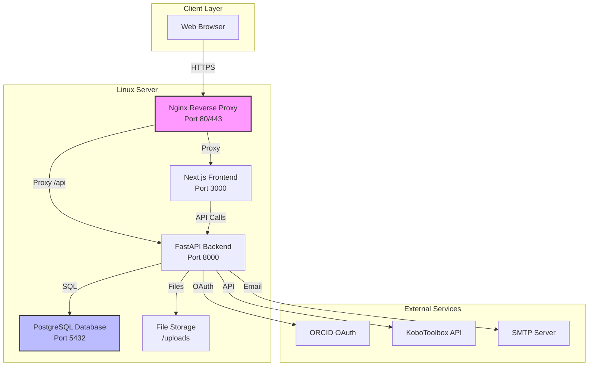
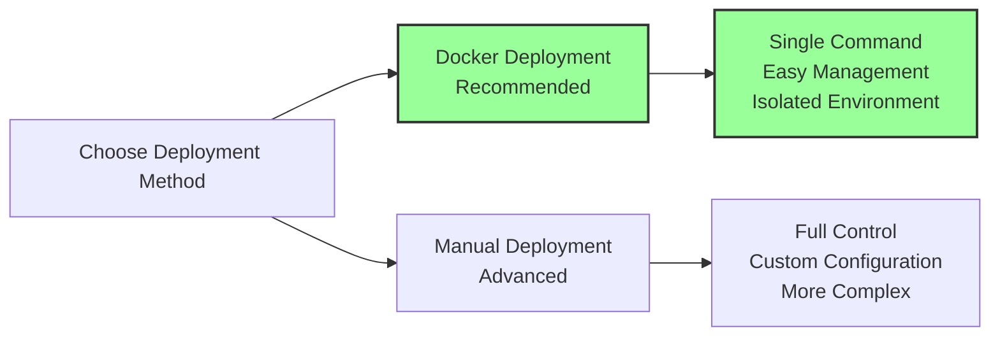
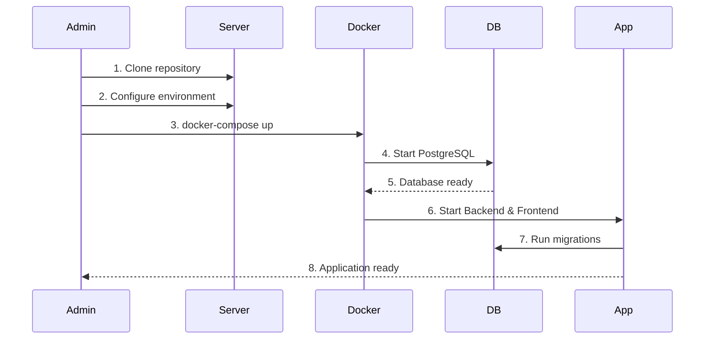
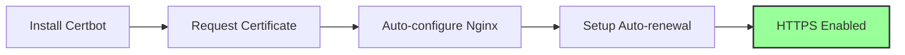
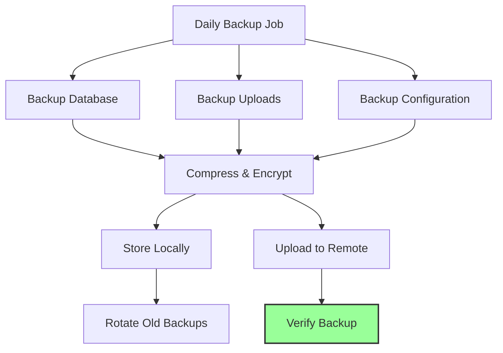

# DACORIS Linux Server Deployment Guide

## Table of Contents
1. [System Overview](#system-overview)
2. [Prerequisites](#prerequisites)
3. [Server Preparation](#server-preparation)
4. [Deployment Methods](#deployment-methods)
5. [Docker Deployment (Recommended)](#docker-deployment-recommended)
6. [Manual Deployment](#manual-deployment)
7. [SSL/TLS Configuration](#ssltls-configuration)
8. [Monitoring and Maintenance](#monitoring-and-maintenance)
9. [Backup Strategy](#backup-strategy)
10. [Troubleshooting](#troubleshooting)

---

## System Overview

DACORIS is a full-stack web application with the following architecture:



### Technology Stack
- **Frontend**: Next.js 16, React 19, Material-UI
- **Backend**: Python FastAPI, Uvicorn
- **Database**: PostgreSQL 15
- **Reverse Proxy**: Nginx
- **Containerization**: Docker & Docker Compose

---

## Prerequisites

### Server Requirements
- **OS**: Ubuntu 20.04 LTS or later (or any modern Linux distribution)
- **RAM**: Minimum 4GB (8GB+ recommended for production)
- **CPU**: 2+ cores recommended
- **Storage**: 20GB+ available disk space
- **Network**: Public IP address or domain name

### Software Requirements
- Docker Engine 24.0+
- Docker Compose 2.0+
- Git
- OpenSSH Server
- (Optional) Certbot for SSL certificates

---

## Server Preparation

### 1. Initial Server Setup

```bash
# Update system packages
sudo apt update && sudo apt upgrade -y

# Install essential tools
sudo apt install -y curl wget git vim ufw fail2ban

# Configure firewall
sudo ufw allow OpenSSH
sudo ufw allow 80/tcp
sudo ufw allow 443/tcp
sudo ufw enable
```

### 2. Create Deployment User

```bash
# Create a dedicated user for the application
sudo adduser dacoris
sudo usermod -aG sudo dacoris
sudo usermod -aG docker dacoris

# Switch to the new user
su - dacoris
```

### 3. Install Docker and Docker Compose

```bash
# Install Docker
curl -fsSL https://get.docker.com -o get-docker.sh
sudo sh get-docker.sh

# Start and enable Docker
sudo systemctl start docker
sudo systemctl enable docker

# Install Docker Compose
sudo curl -L "https://github.com/docker/compose/releases/latest/download/docker-compose-$(uname -s)-$(uname -m)" -o /usr/local/bin/docker-compose
sudo chmod +x /usr/local/bin/docker-compose

# Verify installations
docker --version
docker-compose --version
```

---

## Deployment Methods



---

## Docker Deployment (Recommended)

### Deployment Flow



### Step 1: Clone the Repository

```bash
# Navigate to deployment directory
cd /home/dacoris

# Clone the repository
git clone <your-repository-url> dacoris
cd dacoris
```

### Step 2: Configure Environment Variables

```bash
# Copy the environment template
cp .env.docker .env.production

# Edit the production environment file
nano .env.production
```

**Critical Configuration Parameters:**

```env
# Server Configuration
PORT=8000
FRONTEND_URL=https://yourdomain.com

# Database Configuration
DATABASE_URL=postgresql+asyncpg://postgres:STRONG_PASSWORD_HERE@db:5432/dacoris

# JWT Security (Generate new secret!)
JWT_SECRET_KEY=<generate-strong-random-key>
JWT_ALGORITHM=HS256
ACCESS_TOKEN_EXPIRE_MINUTES=30
ADMIN_SESSION_EXPIRE_MINUTES=480

# ORCID OAuth Configuration
ORCID_CLIENT_ID=<your-orcid-client-id>
ORCID_CLIENT_SECRET=<your-orcid-client-secret>
ORCID_REDIRECT_URI=https://yourdomain.com/api/auth/orcid/callback
ORCID_SANDBOX_MODE=false
ORCID_API_BASE_URL=https://orcid.org

# Admin Configuration
GLOBAL_ADMIN_EMAIL=admin@yourdomain.com

# File Upload Configuration
UPLOAD_DIR=/app/uploads
MAX_FILE_SIZE_MB=50

# Email Configuration (Production SMTP)
SMTP_HOST=smtp.yourdomain.com
SMTP_PORT=587
SMTP_USER=noreply@yourdomain.com
SMTP_PASSWORD=<your-smtp-password>
FROM_EMAIL="DACORIS <no-reply@yourdomain.com>"
NOTIFICATION_MODE=email

# External APIs
KOBO_API_BASE_URL=https://kf.kobotoolbox.org/api/v2
```

**Generate Strong JWT Secret:**
```bash
python3 -c "import secrets; print(secrets.token_hex(32))"
```

### Step 3: Update Docker Compose for Production

Create a production-specific compose file:

```bash
nano docker-compose.prod.yml
```

```yaml
services:
  db:
    image: postgres:15-alpine
    container_name: dacoris-db
    environment:
      POSTGRES_USER: postgres
      POSTGRES_PASSWORD: ${DB_PASSWORD}
      POSTGRES_DB: dacoris
    volumes:
      - postgres_data:/var/lib/postgresql/data
      - ./backups:/backups
    restart: always
    healthcheck:
      test: ["CMD-SHELL", "pg_isready -U postgres"]
      interval: 10s
      timeout: 5s
      retries: 5
    networks:
      - dacoris-network

  backend:
    build:
      context: ./backend
      dockerfile: Dockerfile
    container_name: dacoris-backend
    env_file:
      - .env.production
    volumes:
      - ./backend/uploads:/app/uploads
      - ./logs:/app/logs
    depends_on:
      db:
        condition: service_healthy
    restart: always
    networks:
      - dacoris-network

  frontend:
    build:
      context: ./frontend
      dockerfile: Dockerfile
      args:
        NEXT_PUBLIC_API_URL: /api
        NEXT_PUBLIC_ORCID_CLIENT_ID: ${ORCID_CLIENT_ID}
    container_name: dacoris-frontend
    environment:
      - NEXT_PUBLIC_API_URL=/api
      - NEXT_PUBLIC_ORCID_CLIENT_ID=${ORCID_CLIENT_ID}
    restart: always
    networks:
      - dacoris-network

  nginx:
    build:
      context: ./nginx
      dockerfile: Dockerfile
    container_name: dacoris-nginx
    ports:
      - "80:80"
      - "443:443"
    volumes:
      - ./nginx/ssl:/etc/nginx/ssl:ro
      - ./nginx/nginx.prod.conf:/etc/nginx/nginx.conf:ro
    depends_on:
      - backend
      - frontend
    restart: always
    networks:
      - dacoris-network

volumes:
  postgres_data:
    driver: local

networks:
  dacoris-network:
    driver: bridge
```

### Step 4: Build and Deploy

```bash
# Build the containers
docker-compose -f docker-compose.prod.yml build

# Start the services
docker-compose -f docker-compose.prod.yml up -d

# Check the status
docker-compose -f docker-compose.prod.yml ps

# View logs
docker-compose -f docker-compose.prod.yml logs -f
```

### Step 5: Initialize the Database

```bash
# Access the backend container
docker exec -it dacoris-backend bash

# Run database migrations
alembic upgrade head

# Create initial admin user (if needed)
python manage.py create-admin

# Exit the container
exit
```

### Step 6: Verify Deployment

```bash
# Check all services are running
docker ps

# Test backend health
curl http://localhost:8000/api/health

# Test frontend
curl http://localhost:3000

# Check nginx
curl http://localhost
```

---

## Manual Deployment

### Architecture for Manual Deployment

```mermaid
graph TB
    subgraph "System Services"
        A[Systemd Service<br/>dacoris-backend]
        B[Systemd Service<br/>dacoris-frontend]
        C[PostgreSQL Service]
        D[Nginx Service]
    end
    
    subgraph "Application Files"
        E[/opt/dacoris/backend]
        F[/opt/dacoris/frontend]
        G[/var/lib/postgresql]
        H[/var/www/uploads]
    end
    
    A --> E
    B --> F
    C --> G
    A --> C
    D --> A
    D --> B
    
    style A fill:#faa,stroke:#333,stroke-width:2px
    style B fill:#faa,stroke:#333,stroke-width:2px
```

### Step 1: Install System Dependencies

```bash
# Install PostgreSQL
sudo apt install -y postgresql postgresql-contrib

# Install Python
sudo apt install -y python3.11 python3.11-venv python3-pip

# Install Node.js
curl -fsSL https://deb.nodesource.com/setup_20.x | sudo -E bash -
sudo apt install -y nodejs

# Install Nginx
sudo apt install -y nginx
```

### Step 2: Setup PostgreSQL

```bash
# Start PostgreSQL
sudo systemctl start postgresql
sudo systemctl enable postgresql

# Create database and user
sudo -u postgres psql << EOF
CREATE DATABASE dacoris;
CREATE USER dacoris_user WITH ENCRYPTED PASSWORD 'your_secure_password';
GRANT ALL PRIVILEGES ON DATABASE dacoris TO dacoris_user;
\q
EOF
```

### Step 3: Deploy Backend

```bash
# Create application directory
sudo mkdir -p /opt/dacoris
sudo chown dacoris:dacoris /opt/dacoris

# Clone and setup backend
cd /opt/dacoris
git clone <repository-url> .

# Setup Python virtual environment
cd backend
python3.11 -m venv venv
source venv/bin/activate
pip install -r requirements.txt

# Configure environment
cp .env.example .env
nano .env  # Edit with production values

# Run migrations
alembic upgrade head

# Create uploads directory
sudo mkdir -p /var/www/dacoris/uploads
sudo chown dacoris:dacoris /var/www/dacoris/uploads
```

### Step 4: Create Backend Systemd Service

```bash
sudo nano /etc/systemd/system/dacoris-backend.service
```

```ini
[Unit]
Description=DACORIS FastAPI Backend
After=network.target postgresql.service
Requires=postgresql.service

[Service]
Type=simple
User=dacoris
Group=dacoris
WorkingDirectory=/opt/dacoris/backend
Environment="PATH=/opt/dacoris/backend/venv/bin"
EnvironmentFile=/opt/dacoris/backend/.env
ExecStart=/opt/dacoris/backend/venv/bin/uvicorn main:app --host 0.0.0.0 --port 8000 --workers 4
Restart=always
RestartSec=10

[Install]
WantedBy=multi-user.target
```

### Step 5: Deploy Frontend

```bash
# Build frontend
cd /opt/dacoris/frontend
npm ci
npm run build

# Configure environment
echo "NEXT_PUBLIC_API_URL=/api" > .env.production
echo "NEXT_PUBLIC_ORCID_CLIENT_ID=your-client-id" >> .env.production
```

### Step 6: Create Frontend Systemd Service

```bash
sudo nano /etc/systemd/system/dacoris-frontend.service
```

```ini
[Unit]
Description=DACORIS Next.js Frontend
After=network.target

[Service]
Type=simple
User=dacoris
Group=dacoris
WorkingDirectory=/opt/dacoris/frontend
Environment="PATH=/usr/bin:/usr/local/bin"
Environment="NODE_ENV=production"
ExecStart=/usr/bin/npm start
Restart=always
RestartSec=10

[Install]
WantedBy=multi-user.target
```

### Step 7: Configure Nginx

```bash
sudo nano /etc/nginx/sites-available/dacoris
```

```nginx
upstream backend {
    server 127.0.0.1:8000;
}

upstream frontend {
    server 127.0.0.1:3000;
}

server {
    listen 80;
    server_name yourdomain.com www.yourdomain.com;
    client_max_body_size 50M;

    location /api {
        proxy_pass http://backend;
        proxy_set_header Host $host;
        proxy_set_header X-Real-IP $remote_addr;
        proxy_set_header X-Forwarded-For $proxy_add_x_forwarded_for;
        proxy_set_header X-Forwarded-Proto $scheme;
        proxy_redirect off;
    }

    location /docs {
        proxy_pass http://backend;
        proxy_set_header Host $host;
        proxy_set_header X-Real-IP $remote_addr;
        proxy_set_header X-Forwarded-For $proxy_add_x_forwarded_for;
        proxy_set_header X-Forwarded-Proto $scheme;
    }

    location / {
        proxy_pass http://frontend;
        proxy_set_header Host $host;
        proxy_set_header X-Real-IP $remote_addr;
        proxy_set_header X-Forwarded-For $proxy_add_x_forwarded_for;
        proxy_set_header X-Forwarded-Proto $scheme;
        proxy_http_version 1.1;
        proxy_set_header Upgrade $http_upgrade;
        proxy_set_header Connection 'upgrade';
        proxy_cache_bypass $http_upgrade;
    }
}
```

```bash
# Enable the site
sudo ln -s /etc/nginx/sites-available/dacoris /etc/nginx/sites-enabled/
sudo nginx -t
sudo systemctl restart nginx
```

### Step 8: Start All Services

```bash
# Reload systemd
sudo systemctl daemon-reload

# Start and enable services
sudo systemctl start dacoris-backend
sudo systemctl enable dacoris-backend
sudo systemctl start dacoris-frontend
sudo systemctl enable dacoris-frontend

# Check status
sudo systemctl status dacoris-backend
sudo systemctl status dacoris-frontend
```

---

## SSL/TLS Configuration

### Using Let's Encrypt (Certbot)



### Step 1: Install Certbot

```bash
sudo apt install -y certbot python3-certbot-nginx
```

### Step 2: Obtain SSL Certificate

```bash
# For Docker deployment
sudo certbot certonly --standalone -d yourdomain.com -d www.yourdomain.com

# For manual deployment with Nginx
sudo certbot --nginx -d yourdomain.com -d www.yourdomain.com
```

### Step 3: Update Nginx Configuration for SSL (Docker)

Create `nginx/nginx.prod.conf`:

```nginx
upstream backend {
    server backend:8000;
}

upstream frontend {
    server frontend:3000;
}

server {
    listen 80;
    server_name yourdomain.com www.yourdomain.com;
    return 301 https://$server_name$request_uri;
}

server {
    listen 443 ssl http2;
    server_name yourdomain.com www.yourdomain.com;
    client_max_body_size 50M;

    ssl_certificate /etc/nginx/ssl/fullchain.pem;
    ssl_certificate_key /etc/nginx/ssl/privkey.pem;
    ssl_protocols TLSv1.2 TLSv1.3;
    ssl_ciphers HIGH:!aNULL:!MD5;
    ssl_prefer_server_ciphers on;

    location /api {
        proxy_pass http://backend;
        proxy_set_header Host $host;
        proxy_set_header X-Real-IP $remote_addr;
        proxy_set_header X-Forwarded-For $proxy_add_x_forwarded_for;
        proxy_set_header X-Forwarded-Proto $scheme;
        proxy_redirect off;
    }

    location /docs {
        proxy_pass http://backend;
        proxy_set_header Host $host;
        proxy_set_header X-Real-IP $remote_addr;
        proxy_set_header X-Forwarded-For $proxy_add_x_forwarded_for;
        proxy_set_header X-Forwarded-Proto $scheme;
    }

    location / {
        proxy_pass http://frontend;
        proxy_set_header Host $host;
        proxy_set_header X-Real-IP $remote_addr;
        proxy_set_header X-Forwarded-For $proxy_add_x_forwarded_for;
        proxy_set_header X-Forwarded-Proto $scheme;
        proxy_http_version 1.1;
        proxy_set_header Upgrade $http_upgrade;
        proxy_set_header Connection 'upgrade';
        proxy_cache_bypass $http_upgrade;
    }
}
```

### Step 4: Copy SSL Certificates (Docker)

```bash
# Create SSL directory
mkdir -p nginx/ssl

# Copy certificates
sudo cp /etc/letsencrypt/live/yourdomain.com/fullchain.pem nginx/ssl/
sudo cp /etc/letsencrypt/live/yourdomain.com/privkey.pem nginx/ssl/
sudo chown -R dacoris:dacoris nginx/ssl
```

### Step 5: Setup Auto-renewal

```bash
# Test renewal
sudo certbot renew --dry-run

# Certbot automatically sets up a cron job for renewal
# Verify it exists
sudo systemctl status certbot.timer
```

---

## Monitoring and Maintenance

### Health Check Endpoints

```mermaid
graph TB
    A[Monitoring System] --> B[/api/health]
    A --> C[Database Connection]
    A --> D[Disk Space]
    A --> E[Container Status]
    
    B --> F{Status OK?}
    C --> F
    D --> F
    E --> F
    
    F -->|Yes| G[System Healthy]
    F -->|No| H[Alert Admin]
    
    style G fill:#9f9,stroke:#333,stroke-width:2px
    style H fill:#f99,stroke:#333,stroke-width:2px
```

### Monitoring Script

Create `/opt/dacoris/scripts/health-check.sh`:

```bash
#!/bin/bash

# Health check script for DACORIS
LOG_FILE="/var/log/dacoris/health-check.log"
ALERT_EMAIL="admin@yourdomain.com"

echo "[$(date)] Starting health check..." >> $LOG_FILE

# Check backend health
BACKEND_STATUS=$(curl -s -o /dev/null -w "%{http_code}" http://localhost:8000/api/health)
if [ "$BACKEND_STATUS" != "200" ]; then
    echo "[$(date)] ERROR: Backend health check failed (HTTP $BACKEND_STATUS)" >> $LOG_FILE
    echo "Backend health check failed" | mail -s "DACORIS Alert" $ALERT_EMAIL
fi

# Check frontend
FRONTEND_STATUS=$(curl -s -o /dev/null -w "%{http_code}" http://localhost:3000)
if [ "$FRONTEND_STATUS" != "200" ]; then
    echo "[$(date)] ERROR: Frontend health check failed (HTTP $FRONTEND_STATUS)" >> $LOG_FILE
    echo "Frontend health check failed" | mail -s "DACORIS Alert" $ALERT_EMAIL
fi

# Check disk space
DISK_USAGE=$(df -h / | awk 'NR==2 {print $5}' | sed 's/%//')
if [ "$DISK_USAGE" -gt 85 ]; then
    echo "[$(date)] WARNING: Disk usage is at ${DISK_USAGE}%" >> $LOG_FILE
    echo "Disk usage is at ${DISK_USAGE}%" | mail -s "DACORIS Disk Alert" $ALERT_EMAIL
fi

# Check Docker containers (if using Docker)
if command -v docker &> /dev/null; then
    STOPPED_CONTAINERS=$(docker ps -a --filter "status=exited" --filter "name=dacoris" --format "{{.Names}}")
    if [ ! -z "$STOPPED_CONTAINERS" ]; then
        echo "[$(date)] ERROR: Stopped containers: $STOPPED_CONTAINERS" >> $LOG_FILE
        echo "Containers stopped: $STOPPED_CONTAINERS" | mail -s "DACORIS Container Alert" $ALERT_EMAIL
    fi
fi

echo "[$(date)] Health check completed" >> $LOG_FILE
```

```bash
# Make executable
chmod +x /opt/dacoris/scripts/health-check.sh

# Add to crontab (run every 5 minutes)
crontab -e
# Add: */5 * * * * /opt/dacoris/scripts/health-check.sh
```

### Log Management

```bash
# View Docker logs
docker-compose -f docker-compose.prod.yml logs -f --tail=100

# View specific service logs
docker logs dacoris-backend --tail=100 -f
docker logs dacoris-frontend --tail=100 -f

# For manual deployment
sudo journalctl -u dacoris-backend -f
sudo journalctl -u dacoris-frontend -f
```

### Resource Monitoring

```bash
# Install monitoring tools
sudo apt install -y htop iotop nethogs

# Monitor Docker container resources
docker stats

# Monitor system resources
htop
```

---

## Backup Strategy

### Backup Flow



### Automated Backup Script

Create `/opt/dacoris/scripts/backup.sh`:

```bash
#!/bin/bash

# DACORIS Backup Script
BACKUP_DIR="/var/backups/dacoris"
DATE=$(date +%Y%m%d_%H%M%S)
RETENTION_DAYS=30

# Create backup directory
mkdir -p $BACKUP_DIR

# Backup PostgreSQL database
echo "Backing up database..."
if command -v docker &> /dev/null; then
    # Docker deployment
    docker exec dacoris-db pg_dump -U postgres dacoris | gzip > $BACKUP_DIR/db_$DATE.sql.gz
else
    # Manual deployment
    sudo -u postgres pg_dump dacoris | gzip > $BACKUP_DIR/db_$DATE.sql.gz
fi

# Backup uploads directory
echo "Backing up uploads..."
if [ -d "/opt/dacoris/backend/uploads" ]; then
    tar -czf $BACKUP_DIR/uploads_$DATE.tar.gz -C /opt/dacoris/backend uploads
elif [ -d "/var/www/dacoris/uploads" ]; then
    tar -czf $BACKUP_DIR/uploads_$DATE.tar.gz -C /var/www/dacoris uploads
fi

# Backup configuration files
echo "Backing up configuration..."
tar -czf $BACKUP_DIR/config_$DATE.tar.gz \
    /opt/dacoris/.env.production \
    /opt/dacoris/docker-compose.prod.yml \
    /etc/nginx/sites-available/dacoris 2>/dev/null

# Remove old backups
echo "Cleaning old backups..."
find $BACKUP_DIR -name "*.gz" -mtime +$RETENTION_DAYS -delete

# Optional: Upload to remote storage (S3, rsync, etc.)
# aws s3 sync $BACKUP_DIR s3://your-backup-bucket/dacoris/

echo "Backup completed: $DATE"
```

```bash
# Make executable
chmod +x /opt/dacoris/scripts/backup.sh

# Add to crontab (daily at 2 AM)
sudo crontab -e
# Add: 0 2 * * * /opt/dacoris/scripts/backup.sh >> /var/log/dacoris/backup.log 2>&1
```

### Restore from Backup

```bash
# Restore database
gunzip < /var/backups/dacoris/db_YYYYMMDD_HHMMSS.sql.gz | \
    docker exec -i dacoris-db psql -U postgres dacoris

# Restore uploads
tar -xzf /var/backups/dacoris/uploads_YYYYMMDD_HHMMSS.tar.gz -C /opt/dacoris/backend/

# Restart services
docker-compose -f docker-compose.prod.yml restart
```

---

## Troubleshooting

### Common Issues and Solutions

#### 1. Database Connection Failed

```bash
# Check database is running
docker ps | grep dacoris-db
# or
sudo systemctl status postgresql

# Check database logs
docker logs dacoris-db
# or
sudo journalctl -u postgresql

# Test connection
docker exec -it dacoris-db psql -U postgres -d dacoris
```

#### 2. Backend Not Responding

```bash
# Check backend logs
docker logs dacoris-backend --tail=100
# or
sudo journalctl -u dacoris-backend -n 100

# Check if port is listening
sudo netstat -tlnp | grep 8000

# Restart backend
docker-compose -f docker-compose.prod.yml restart backend
# or
sudo systemctl restart dacoris-backend
```

#### 3. Frontend Build Errors

```bash
# Check frontend logs
docker logs dacoris-frontend --tail=100

# Rebuild frontend
docker-compose -f docker-compose.prod.yml build --no-cache frontend
docker-compose -f docker-compose.prod.yml up -d frontend
```

#### 4. Nginx Configuration Errors

```bash
# Test nginx configuration
sudo nginx -t

# Check nginx logs
sudo tail -f /var/log/nginx/error.log

# Reload nginx
sudo systemctl reload nginx
```

#### 5. SSL Certificate Issues

```bash
# Check certificate expiry
sudo certbot certificates

# Renew certificate manually
sudo certbot renew

# Test SSL configuration
curl -vI https://yourdomain.com
```

#### 6. Out of Disk Space

```bash
# Check disk usage
df -h

# Clean Docker resources
docker system prune -a --volumes

# Clean old logs
sudo journalctl --vacuum-time=7d

# Remove old backups
find /var/backups/dacoris -mtime +30 -delete
```

### Debug Mode

Enable debug logging in `.env.production`:

```env
LOG_LEVEL=DEBUG
UVICORN_LOG_LEVEL=debug
```

Restart services to apply changes.

---

## Security Checklist

- [ ] Change all default passwords
- [ ] Generate strong JWT secret key
- [ ] Configure firewall (UFW)
- [ ] Enable fail2ban for SSH protection
- [ ] Install SSL/TLS certificates
- [ ] Set up automatic security updates
- [ ] Configure proper file permissions
- [ ] Enable database authentication
- [ ] Set up regular backups
- [ ] Configure log rotation
- [ ] Disable root SSH login
- [ ] Use SSH keys instead of passwords
- [ ] Keep Docker images updated
- [ ] Monitor security logs

---

## Performance Optimization

### Database Optimization

```sql
-- Create indexes for frequently queried columns
CREATE INDEX idx_users_email ON users(email);
CREATE INDEX idx_users_orcid ON users(orcid_id);

-- Analyze tables
ANALYZE;

-- Vacuum database
VACUUM ANALYZE;
```

### Backend Optimization

```bash
# Increase Uvicorn workers in production
# Edit docker-compose.prod.yml or systemd service
CMD ["uvicorn", "main:app", "--host", "0.0.0.0", "--port", "8000", "--workers", "4"]
```

### Nginx Caching

Add to nginx configuration:

```nginx
# Enable gzip compression
gzip on;
gzip_vary on;
gzip_min_length 1024;
gzip_types text/plain text/css text/xml text/javascript application/javascript application/json;

# Cache static files
location ~* \.(jpg|jpeg|png|gif|ico|css|js)$ {
    expires 1y;
    add_header Cache-Control "public, immutable";
}
```

---

## Maintenance Schedule

| Task | Frequency | Command |
|------|-----------|---------|
| Check logs | Daily | `docker-compose logs --tail=100` |
| Database backup | Daily | Automated via cron |
| Security updates | Weekly | `sudo apt update && sudo apt upgrade` |
| Docker cleanup | Weekly | `docker system prune` |
| Certificate renewal | Automatic | Certbot handles this |
| Full system backup | Weekly | Run backup script |
| Performance review | Monthly | Check metrics and logs |
| Dependency updates | Monthly | Update requirements.txt and package.json |

---

## Support and Resources

- **Documentation**: `/docs` endpoint on your server
- **API Documentation**: `https://yourdomain.com/docs`
- **Health Check**: `https://yourdomain.com/api/health`
- **Logs Location**: 
  - Docker: `docker logs <container-name>`
  - Manual: `/var/log/dacoris/`

---

## Quick Reference Commands

### Docker Deployment

```bash
# Start services
docker-compose -f docker-compose.prod.yml up -d

# Stop services
docker-compose -f docker-compose.prod.yml down

# Restart a service
docker-compose -f docker-compose.prod.yml restart backend

# View logs
docker-compose -f docker-compose.prod.yml logs -f

# Update and redeploy
git pull
docker-compose -f docker-compose.prod.yml build
docker-compose -f docker-compose.prod.yml up -d
```

### Manual Deployment

```bash
# Start services
sudo systemctl start dacoris-backend dacoris-frontend

# Stop services
sudo systemctl stop dacoris-backend dacoris-frontend

# Restart services
sudo systemctl restart dacoris-backend dacoris-frontend

# View logs
sudo journalctl -u dacoris-backend -f
```

---

**Document Version**: 1.0  
**Last Updated**: 2026-04-16  
**Maintained By**: DACORIS Team
